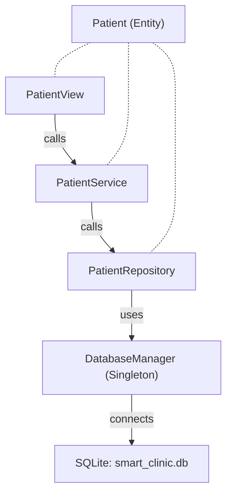

# Walkthrough — Module Patient (SmartClinicSystem)

## Tổng quan

Đã xây dựng hoàn chỉnh module quản lý bệnh nhân (Patient) theo kiến trúc phân lớp 5 tầng. Tổng cộng **14 file mới** + **2 file sửa**.

## Kiến trúc



## Files đã tạo/sửa

### Model Layer
| File | Mô tả |
|------|--------|
| [Patient.h](file:///d:/VSCODE/SmartClinicSystem/src/model/Patient.h) | Entity class + `Gender` enum, 10 trường: id, fullName, birthDate, gender, phoneNumber, address, **citizenId**, **email**, **insurance**, isActive |
| [Patient.cpp](file:///d:/VSCODE/SmartClinicSystem/src/model/Patient.cpp) | Constructor, getters, setters, `isValid()` |

### Repository Layer
| File | Mô tả |
|------|--------|
| [DatabaseManager.h](file:///d:/VSCODE/SmartClinicSystem/src/repository/DatabaseManager.h) | Singleton quản lý kết nối SQLite |
| [DatabaseManager.cpp](file:///d:/VSCODE/SmartClinicSystem/src/repository/DatabaseManager.cpp) | Mở DB, tạo bảng `patients`, bật foreign keys |
| [PatientRepository.h](file:///d:/VSCODE/SmartClinicSystem/src/repository/PatientRepository.h) | CRUD interface (insert, update, softDelete, findById, findAllActive, searchByName) |
| [PatientRepository.cpp](file:///d:/VSCODE/SmartClinicSystem/src/repository/PatientRepository.cpp) | SQL queries với prepared statements |

### Service Layer
| File | Mô tả |
|------|--------|
| [PatientService.h](file:///d:/VSCODE/SmartClinicSystem/src/service/PatientService.h) | Business logic interface |
| [PatientService.cpp](file:///d:/VSCODE/SmartClinicSystem/src/service/PatientService.cpp) | Validation + delegate to repository |

### UI Layer
| File | Mô tả |
|------|--------|
| [PatientTableModel.h](file:///d:/VSCODE/SmartClinicSystem/src/ui/PatientTableModel.h) | QAbstractTableModel, 9 cột hiển thị |
| [PatientTableModel.cpp](file:///d:/VSCODE/SmartClinicSystem/src/ui/PatientTableModel.cpp) | Mapping data → cells, Vietnamese headers |
| [PatientFormDialog.h](file:///d:/VSCODE/SmartClinicSystem/src/ui/PatientFormDialog.h) | Dialog thêm/sửa bệnh nhân |
| [PatientFormDialog.cpp](file:///d:/VSCODE/SmartClinicSystem/src/ui/PatientFormDialog.cpp) | Form validation, 8 input fields |
| [PatientView.h](file:///d:/VSCODE/SmartClinicSystem/src/ui/PatientView.h) | Trang chính quản lý bệnh nhân |
| [PatientView.cpp](file:///d:/VSCODE/SmartClinicSystem/src/ui/PatientView.cpp) | Table + search + CRUD buttons |

### Integration (sửa)
| File | Mô tả |
|------|--------|
| [MainWindow.h](file:///d:/VSCODE/SmartClinicSystem/src/ui/MainWindow.h) | Thêm dependency members |
| [MainWindow.cpp](file:///d:/VSCODE/SmartClinicSystem/src/ui/MainWindow.cpp) | Dependency chain init, PatientView as central widget |

## Database Schema

```sql
CREATE TABLE IF NOT EXISTS patients (
    id           INTEGER PRIMARY KEY AUTOINCREMENT,
    full_name    TEXT    NOT NULL,
    birth_date   TEXT,
    gender       TEXT    DEFAULT 'Other',
    phone_number TEXT,
    address      TEXT,
    citizen_id   TEXT,
    email        TEXT,
    insurance    TEXT,
    is_active    INTEGER DEFAULT 1
);
```

File DB: `smart_clinic.db` (tự tạo cùng thư mục executable)

## Verification

- ✅ **Build**: `cmake --build build --config Debug` — 0 errors, 0 warnings
- ⬜ **Manual test**: Chạy `build/Debug/SmartClinicSystem.exe` để test CRUD

## Hướng dẫn test

1. Chạy exe → Cửa sổ hiện bảng trống (chưa có dữ liệu)
2. Nhấn **Thêm** → Điền form → **Lưu** → Bệnh nhân xuất hiện trong bảng
3. Chọn dòng → Nhấn **Sửa** → Sửa thông tin → **Lưu** → Dữ liệu cập nhật
4. Chọn dòng → Nhấn **Xóa** → Xác nhận → Bệnh nhân biến mất
5. Gõ tên vào ô tìm kiếm → Nhấn **Tìm** → Kết quả lọc theo tên
