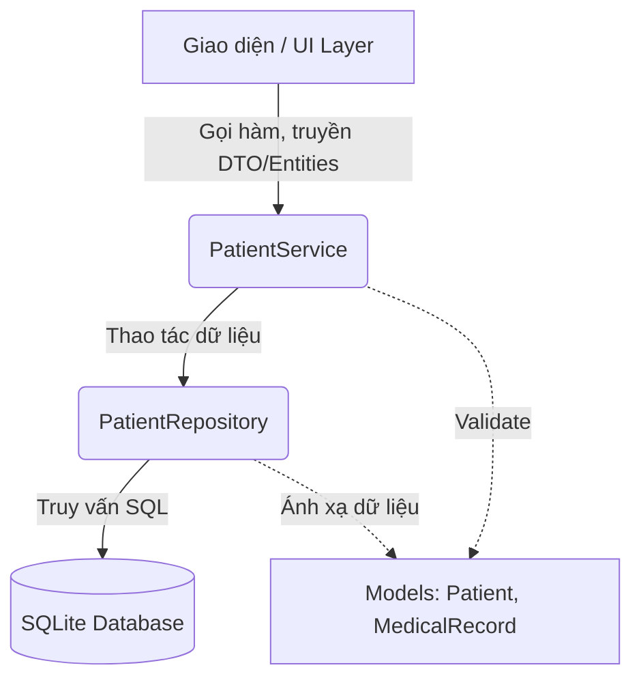

# Phân tích Cấu trúc và Luồng hoạt động của Module Bệnh Nhân

Tài liệu này mô tả chi tiết kiến trúc, các thành phần và luồng dữ liệu (data flow) của Module Quản lý Bệnh nhân (Patient Module) trong hệ thống Smart Clinic System. Kiến trúc được thiết kế theo mô hình phân tầng (Layered Architecture) với sự áp dụng của các Design Patterns để đảm bảo tính mở rộng, dễ bảo trì và dễ kiểm thử.

---

## 1. Kiến trúc Phân tầng (Layered Architecture)

Module Bệnh nhân được chia làm 3 tầng chính ở Backend:
1. **Model (Tầng Dữ liệu & Nghiệp vụ cốt lõi)**: Định nghĩa các thực thể (Entities) và các mẫu thiết kế hướng đối tượng.
2. **Repository (Tầng Truy cập Dữ liệu)**: Chịu trách nhiệm tương tác với cơ sở dữ liệu SQLite.
3. **Service (Tầng Dịch vụ & Logic)**: Cầu nối giữa UI và Repository, thực hiện validate dữ liệu và các logic nghiệp vụ phức tạp.

---

## 2. Chi tiết các Thành phần (Components)

### 2.1. Tầng Model (`src/model/`)
Đây là trái tim của hệ thống, lưu trữ dữ liệu và trạng thái.
- **Kế thừa và Đa hình (Polymorphism)**:
  - `Patient` là một *Lớp trừu tượng (Abstract Class)* chứa thông tin chung (Mã BN sinh bằng UUID, Họ tên, Ngày sinh, Dị ứng, CCCD, Tiền sử bệnh lý,...).
  - Có 3 lớp kế thừa: `OutPatient` (Ngoại trú), `InPatient` (Nội trú), và `EmergencyPatient` (Cấp cứu). Mỗi loại có cách tính phí (`getBaseFee()`) và độ ưu tiên (`getPriority()`) khác nhau.
- **State Pattern (Mẫu Trạng thái)**:
  - Quá trình khám bệnh được quản lý qua `IPatientState`.
  - Các trạng thái (Ví dụ: `RegisteredState`, `ExaminingState`, `DischargedState`) quyết định bệnh nhân đang ở bước nào và có thể chuyển sang bước tiếp theo hay không thông qua hàm `advanceState()`.
- **Hồ sơ Y tế (MedicalRecord)**:
  - Chứa thông tin về mỗi lần khám: Vitals (Sinh hiệu), Clinical Notes (Ghi chú lâm sàng), Test Results (Kết quả xét nghiệm), và Treatment (Hướng điều trị). Liên kết với `Patient` qua `patient_id`.

### 2.2. Tầng Repository (`src/repository/`)
Cô lập toàn bộ code SQL, giúp các tầng trên không cần quan tâm đến SQLite.
- **`PatientRepository`**:
  - Dùng *Parameterized Queries (Bind values)* cho mọi câu lệnh (`INSERT`, `UPDATE`, `SELECT`) để ngăn chặn hoàn toàn **SQL Injection**.
  - **`searchPatients()`**: Hỗ trợ tìm kiếm động theo nhiều tiêu chí (Tên, Mã, CCCD, Số điện thoại) được gom gọn trong struct `PatientSearchCriteria`.
  - **`mapRowToPatient()`**: Một Factory Method nội bộ để đọc dữ liệu từ DB, sau đó dựa vào cột `patient_type` để khởi tạo đúng loại đối tượng (`OutPatient`, `InPatient`,...).
- **`DatabaseManager`**: Áp dụng *Singleton Pattern*, đảm bảo chỉ có duy nhất 1 kết nối Database mở ra trong suốt vòng đời ứng dụng. Đồng thời chứa các lệnh tạo bảng (`CREATE TABLE`) và cập nhật cấu trúc (`ALTER TABLE`).

### 2.3. Tầng Service (`src/service/`)
Bọc logic nghiệp vụ, giao tiếp với Repository.
- **`PatientService`**:
  - Nhận yêu cầu từ Controller/UI.
  - Trước khi gọi `PatientRepository::insert()`, Service sẽ kiểm tra tính hợp lệ qua `patient->isValid()` (Tên không có số, CCCD đủ 12 số, SDT đủ 10 số, v.v.).
  - **Rule Engine cơ bản (`checkAllergyWarning`)**: Khi bác sĩ kê đơn (truyền danh sách thuốc), Service sẽ duyệt qua `allergies` của `Patient` để trả về CẢNH BÁO nếu phát hiện có phản ứng phụ.

---

## 3. Luồng Hoạt động (Data Flow) Tiêu biểu

### Luồng 1: Thêm mới Bệnh nhân
1. **Khởi tạo**: Người dùng nhập dữ liệu trên UI. UI tạo một đối tượng `std::shared_ptr<OutPatient>`.
2. **Gọi Service**: UI gọi `PatientService::addPatient(patient)`.
3. **Validate**: Service gọi `patient->isValid()`. Nếu sai, trả về `false`.
4. **Sinh UUID**: `Patient::setId()` được gọi (sau hoặc trước insert), tự động kích hoạt `generatePatientCode()` tạo mã `BN-{UUID}`.
5. **Lưu DB**: Service gọi `PatientRepository::insert()`. Repo tạo chuỗi SQL, map các field (CCCD, medical_history...) và `exec()`.
6. **Hoàn tất**: Trả kết quả về UI. Bệnh nhân có trạng thái mặc định là `RegisteredState`.

### Luồng 2: Cảnh báo Dị ứng Thuốc
1. **Bác sĩ kê đơn**: Chọn thuốc trên UI, truyền danh sách `std::vector<QString> medications`.
2. **Gọi Service**: UI gọi `PatientService::checkAllergyWarning(patientId, medications, outWarning)`.
3. **Truy xuất**: Service dùng Repo lấy `Patient` từ Database.
4. **Kiểm tra (Rule Engine)**: Service gọi `patient->hasAllergy(medication)` cho từng loại thuốc. Hàm này kiểm tra chuỗi `m_allergies` xem có chứa tên thuốc không.
5. **Cảnh báo**: Nếu có, chuỗi `outWarning` được gán nội dung báo động và trả về `true` để UI hiển thị Pop-up đỏ.

---

## 4. Ưu điểm của Kiến trúc hiện tại
- **Loose Coupling (Khớp nối lỏng)**: Đổi Database từ SQLite sang MySQL chỉ cần viết lại `PatientRepository`, giữ nguyên Service và Model.
- **Extensible (Dễ mở rộng)**: Muốn thêm loại bệnh nhân mới (Ví dụ: Khám dịch vụ VIP), chỉ cần tạo class `VipPatient` kế thừa `Patient` và cập nhật hàm `mapRowToPatient`.
- **Testable (Dễ kiểm thử)**: Logic hoàn toàn tách biệt khỏi UI. Ta đã dùng `QTest` để giả lập Database và test trơn tru toàn bộ luồng tạo, lưu và tìm kiếm (`tests/PatientTest.cpp`) mà không cần mở ứng dụng lên.
